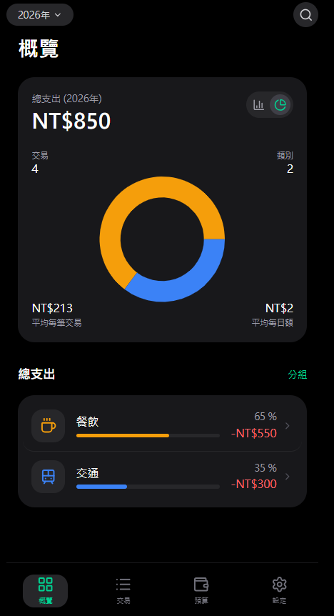
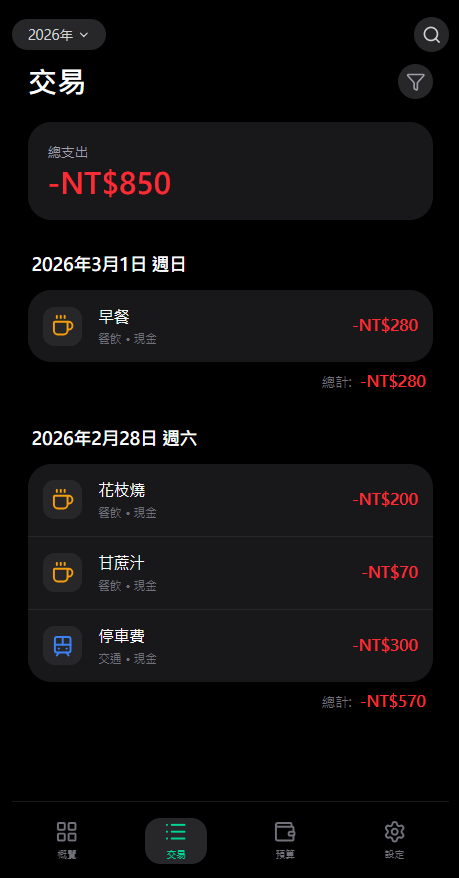
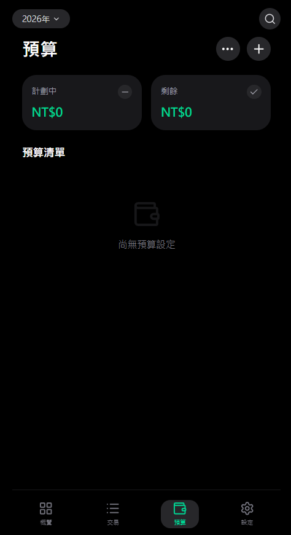

# Budget Records

> A privacy-friendly personal budgeting and expense tracking web app. Built with React 19, Vite, Tailwind CSS v4, and Supabase.

[](./LICENSE)
[](https://github.com/samsam940824/Budget-Records/actions)

**Live demo:** https://samsam940824.github.io/Budget-Records/

> ⚠️ The demo runs against a shared Supabase project. Please **sign up with a throwaway email** — do not enter real financial data on the public demo. For real usage, self-host with your own Supabase project (see below).

---

## What it is

Budget Records is a single-user, mobile-first finance tracker. Each user signs in with Supabase Auth, then records expenses and income, sets budgets per category, and views overviews by month / year / custom date range. All data is stored in your own Supabase project, protected by Row Level Security so users can only ever read or write their own rows.

This repository is intentionally small and readable — it's meant to be forkable and self-hostable, not a SaaS.

## Screenshots

| Overview | Records | Budgets |
|---|---|---|
|  |  |  |

## Features

- **Auth** — Supabase email/password sign-up & sign-in.
- **Transactions** — Add / edit / delete expense and income records with category, payment method, location, note, currency.
- **Budgets** — Per-category budgets with `none / daily / weekly / monthly / yearly` repeat, and a configurable monthly reset day.
- **Overview** — Total income / expense / balance, category pie chart, average daily spend (correctly scaled to the selected date range).
- **Global time filter** — Month / Year / Custom range, applied across overview, records, and budgets.
- **Search** — Full-text search across description and amount.
- **Settings** — Manage categories and payment methods, default currency, budget reset day.
- **Optimistic UI** — Add / edit / delete reflect immediately and roll back on failure.
- **Static deploy** — Builds to a static bundle, auto-deployed to GitHub Pages from `main`.

## Tech stack

| Layer | Choice |
|---|---|
| Frontend | React 19 + TypeScript (strict), Vite 6 |
| Styling | Tailwind CSS v4 (via `@tailwindcss/vite`) |
| Charts | Recharts |
| Icons / Motion | `lucide-react`, `motion` |
| Backend / DB / Auth | Supabase (Postgres + Auth + RLS) |
| Hosting | GitHub Pages (static), GitHub Actions for CI/CD |

## Project structure

```
src/
├── App.tsx              # top-level shell, routing between features
├── main.tsx
├── features/            # UI per feature (auth, overview, records, budgets, settings)
├── hooks/               # useAuth, useTransactions, useBudgets, useOptions, useSettings
├── lib/supabaseClient.ts
├── types/database.types.ts
└── utils/
supabase/
└── migrations/0000_schema.sql   # tables + RLS policies
.github/workflows/        # GitHub Pages deploy
```

## Getting started

### Prerequisites

- Node.js 20+
- A free [Supabase](https://supabase.com) project

### 1. Clone & install

```bash
git clone https://github.com/samsam940824/Budget-Records.git
cd Budget-Records
npm install
```

### 2. Configure Supabase

1. Create a new project at https://supabase.com.
2. In the SQL editor, run [`supabase/migrations/0000_schema.sql`](./supabase/migrations/0000_schema.sql). This creates all tables and enables Row Level Security so users only see their own data.
3. In **Authentication → Providers**, enable Email (and optionally disable email confirmation while developing).
4. Copy your project URL and anon key from **Settings → API**.

### 3. Configure environment

```bash
cp .env.example .env.local
```

Then edit `.env.local`:

```env
VITE_SUPABASE_URL=https://your-project-ref.supabase.co
VITE_SUPABASE_ANON_KEY=your-anon-public-key
```

The anon key is safe to expose to the browser **as long as RLS is enabled** (the migration script does this).

### 4. Run

```bash
npm run dev      # http://localhost:3000
npm run lint     # type-check (tsc --noEmit)
npm run build    # production build into dist/
npm run preview  # serve the production build locally
```

## Data model

All tables live in the `public` schema and are owned by `auth.users(id)` via `user_id`. RLS policies enforce `auth.uid() = user_id` for every read and write.

| Table | Purpose | Key columns |
|---|---|---|
| `user_settings` | Per-user prefs | `default_currency`, `budget_reset_day` |
| `categories` | Expense / income categories | `name`, `icon`, `color`, `sort_order` |
| `payment_methods` | Cash / cards / wallets | `name`, `icon`, `sort_order` |
| `records` | Transactions | `type` (`expense\|income`), `amount`, `category_id`, `date`, `time`, `description`, `currency_code`, `location`, `payment_method_id` |
| `budgets` | Recurring budgets | `category_id`, `amount`, `repeat` (`none\|daily\|weekly\|monthly\|yearly`), `start_date`, `end_date` |

Full schema and RLS policies: [`supabase/migrations/0000_schema.sql`](./supabase/migrations/0000_schema.sql).

## Deployment

The repo ships with a GitHub Actions workflow at `.github/workflows/` that builds and deploys to GitHub Pages on every push to `main`. To use it on your fork:

1. **Settings → Pages → Build and deployment → Source:** select **GitHub Actions**.
2. **Settings → Secrets and variables → Actions** → add repository secrets:
   - `VITE_SUPABASE_URL`
   - `VITE_SUPABASE_ANON_KEY`
3. If your fork's repo name is not `Budget-Records`, update the `base` in `vite.config.ts` to match (e.g. `/your-fork-name/`).

## Roadmap

Tracked as open issues — see [Issues](https://github.com/samsam940824/Budget-Records/issues). Headline items:

- [ ] Export transactions to CSV
- [ ] PWA / offline mode
- [ ] Multi-currency support with FX rates
- [ ] Budget threshold notifications
- [ ] Documented Supabase RLS hardening guide
- [ ] Unit + component test coverage

## Contributing

Issues, bug reports, and pull requests are welcome. Please read [CONTRIBUTING.md](./CONTRIBUTING.md) before opening a PR. For security issues, see [SECURITY.md](./SECURITY.md) — please do not file public issues for vulnerabilities.

## License

[MIT](./LICENSE) © 2026 samsam940824
